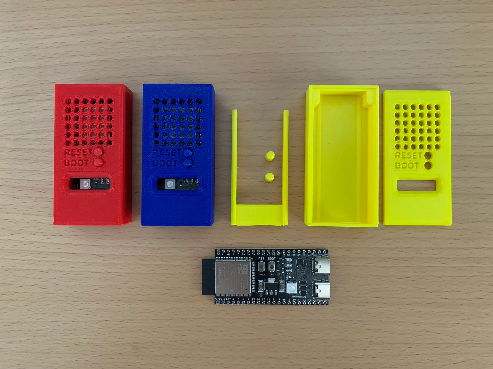
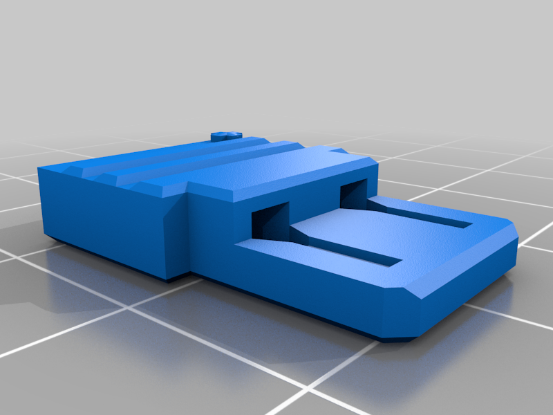

# 3D print models

We use some 3D models in our projects. Feel free to use them in your projects, modify them or buy them in your favorite store. 

## Models and Quantity

Below is the list and quantity used in the projects.

| Model | Description | Quantity |
|-------|-------------|----------|
| [Power Adapter](#power-adapter) | Power up your Breadboard with 5V using Power Bank to make your projects portable. | 2 |
| [ESP32-S3 case](#esp32-s3-case) | Protect your ESP32-S3 with this case. | 1 |

## Download

All models are available at [Thingiverse](https://www.thingiverse.com/){ target="_blank" } and [Printable](https://www.printables.com){ target="_blank" } . Thank you for the community that shares the models.

### ESP32-S3 case

[{ align=right width="200" }](https://www.printables.com/model/565403-teyleten-robot-esp32-s3-wroom-1-case/files){ target="_blank" }

Protect your ESP32-S3 with this case. You can download the 3D model at:

[https://www.printables.com/model/565403-teyleten-robot-esp32-s3-wroom-1-case/files](https://www.printables.com/model/565403-teyleten-robot-esp32-s3-wroom-1-case/files){ target="_blank" }

### Power Adpater

[{ align=right width="200" }](https://www.thingiverse.com/thing:6640089){ target="_blank" }

Power up your Breadboard with 5V using Power Bank to make your projects portable. You can download the 3D model at: 

[https://www.thingiverse.com/thing:6640089](https://www.thingiverse.com/thing:6640089).

## Print steps

1. Download the 3D model from the link above.
2. Open the file in your favorite 3D printer software like Creality Slicer, Cura or PrusaSlicer.
3. Adjust the settings according to your 3D printer.
4. Import the model stl to the software and export the gcode.
5. Transfer the gcode to your 3D printer.
6. Start the print.
7. Print the model.

The steps can follow in this [youtube video](https://www.youtube.com/watch?v=PzQe6xfWyzk){ target="_blank" }.   