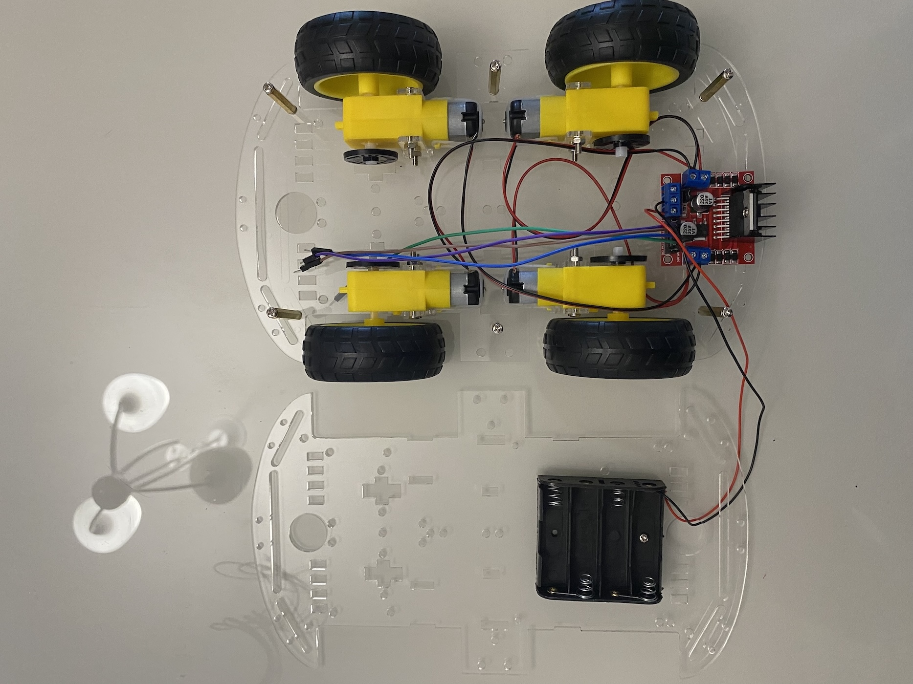

# Assembly Body

{ align=right width=30% }

## Introduction

The body is the main structure of the robot. I use the kit body and you can buy the body in the [Buying list](../components/buying.md) page. Before assembling the body, you need assemble the [chassis, motors and wheels](chassis.md).