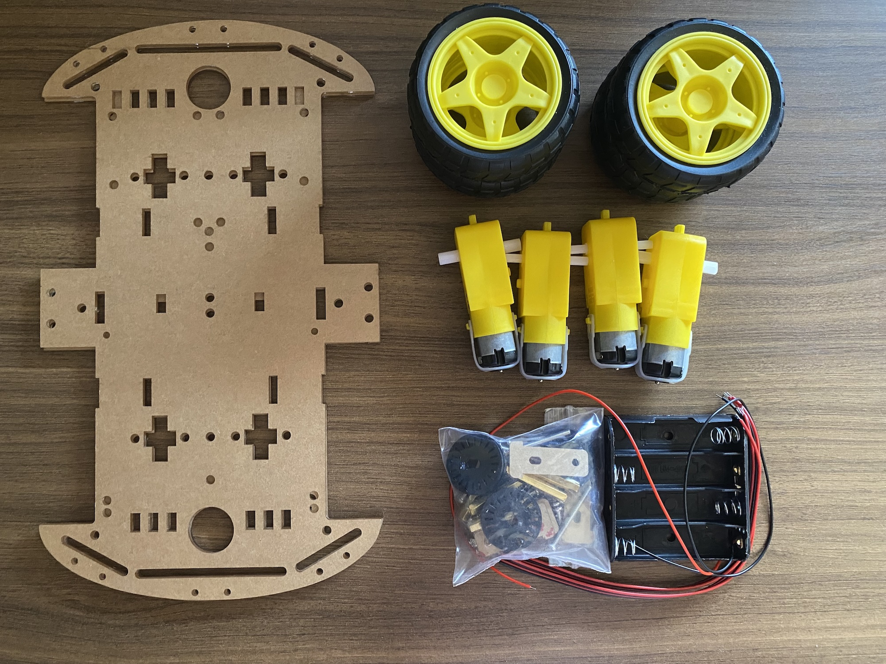
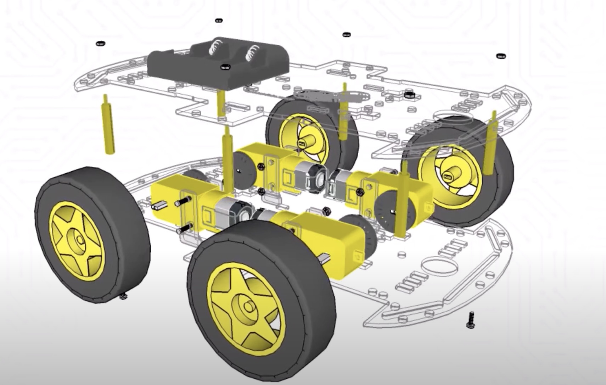

# Assembly Chassis

{ align=right width=30% }

## Introduction

The chassis is the main structure of the robot. I use the kit chassi 4WD and you can buy the chassis in the [Buying list](../components/buying.md) page. After assembling the chassis, you can install the motors and the wheels.

## Tutorial

I use the video below to assemble the chassis.

[{ width=75% }](https://www.youtube.com/watch?v=fSeAtDzGdO4){ target="_blank" }

## Result

{ align=center}