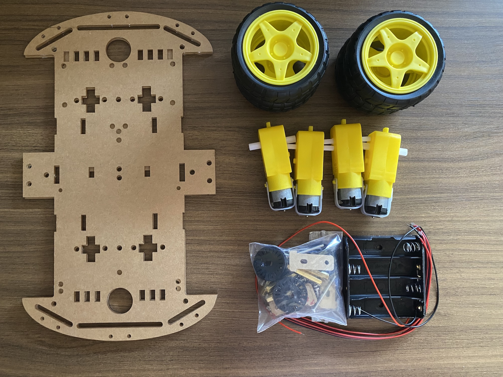
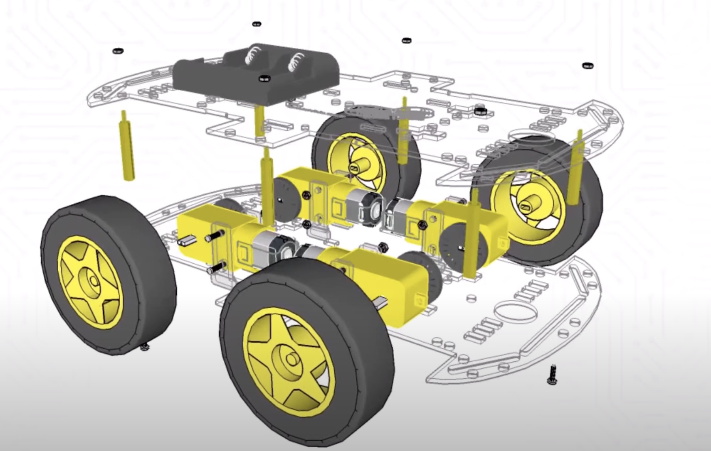
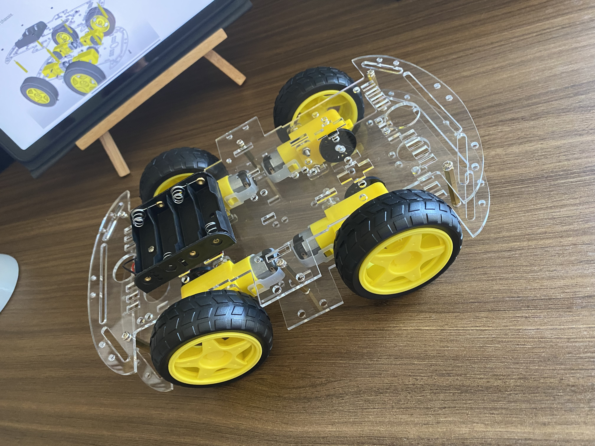

{ align=right width=30% }

## Introduction

The chassis is the main structure of the robot. I use the kit chassi 4WD and you can buy the chassis in the [Buying list](../components/buying.md) page. After assembling the chassis, you can install the motors and the wheels.

## Tutorial

I use the video below to assemble the chassi 4WD.

[{ width=75% }](https://www.youtube.com/watch?v=fSeAtDzGdO4){ target="_blank" }

## Result

When finished assembling the chassi 4WD, it will look like the image below a chassi with 4 wheels connected to the motors.

{ align=center}

After assembling the chassi 4WD, you can install the [body components](body.md) to the robot.
