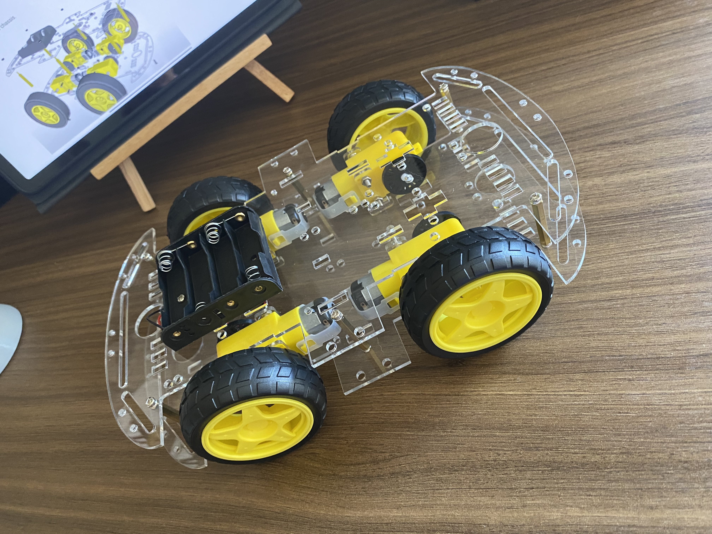

# Assembly Resume

You can find the assembly steps below. We are currently in the process of assembling the robot, adding the components and wiring the robot.

#### Current process

    
30%

### 

### Chassis

{ align=right width=150 }

The chassis is the main structure of the robot. I use the kit chassi 4WD and you can buy the chassis in the [Buying list](../components/buying.md) page. After assembling the chassis, you can install the motors and the wheels.

You can see the assembly process in the [Chassis Page](chassis.md).

### Body

{ align=right width=150 }

Current the body is in construction. The robot content the power supply, driver H bridge connected.

 You can see the assembly process in the [Body Page](body.md).

### Brain

Step not started

### Head

Step not started

