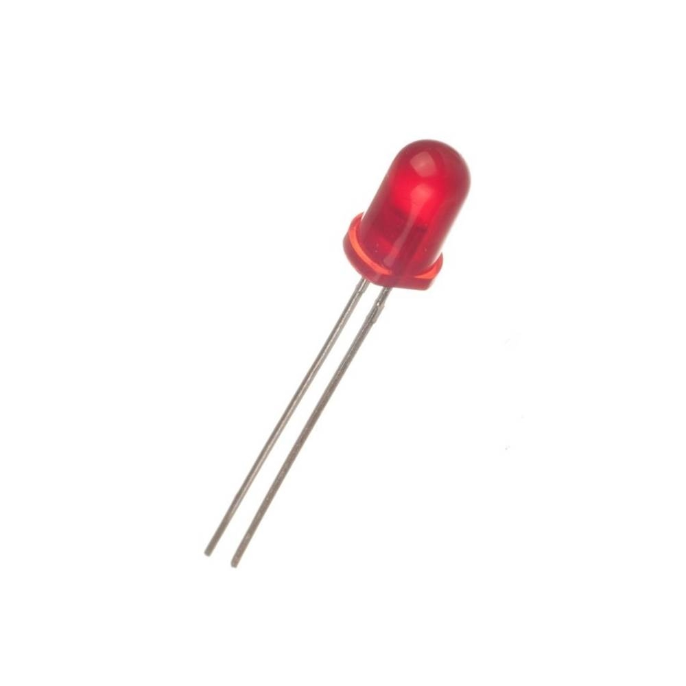

{ align=center }

## Diagram of components

List of components used in the robot and the description of each one and the diagram of the components is applied in the robot.

!!! note "Note"
    If you want to see the **wiring** of the components, go to [Wiring](../wiring/chassis.md) section or all components of **architecture** like hardware and software elements, go to [Components Architecture](../project/architecture.md) in project section.

## List of components

If you want to know more about the components, click on the component name below.

- Eletronics
    - [X] [Protoboard 400 Pontos](#protoboard-400-pontos)
    - [x] [Resistor 1K - 1/4W - 5%](#resistor-1k-14w-5)
    - [x] Resistor 1K - 1/4W
    - [x] [Display IPS 1.47 SPI - ST7789](#display-ips-147-spi-st7789) 
    - [x] [Diodo de Uso Geral - 1N4148 - 100V / 0,2A](#diodo-de-uso-geral-1n4148-100v-02a)
    - [x] [Kit Jumper Macho/Macho - 40 pçs - 20cm](#kit-jumper-machomacho-40-pcs-20cm)
    - [x] [Kit Jumper Macho/Fêmea - 40 pçs - 20cm](#kit-jumper-macho-femea-40-pcs-20cm)
    - [x] [Módulo Driver Ponte H - L298N](#modulo-driver-ponte-h-l298n)
    - [x] [Buzzer 5v 12mm](#buzer-5v-12mm)
    - [x] [LED 5mm - Vermelho, Verde, Azul, Amarelo](#led-5mm-vermelho-verde-azul-amarelo)
    - [x] [Kit Resistores](#kit-resistores)
- Hardware
    - [x] [Placa DevkitC-1 ESP32-S3 N16R8](#devkitc-1-esp32-s3-n16r8)
- Energy
    - [x] [Power Bank 5V 2.1A 10000mAh](#power-bank-5v-21a-10000mah)
    - [x] [Fonte Ajustável Para Protoboard](#fonte-ajustavel-para-protoboard)
- Sensing
    - [x] [Ultrassonic HC-SR04](#ultrassonic-hc-sr04)
    - [x] [Camera VGA 640x480 OV7670](#camera-vga-640x480-ov7670)
    - [x] [Sensor Temperatura e Umidade DHT11](#sensor-temperatura-e-umidade-dht11)
- Infra
    - [x] [Kit Chassi 4WD](#kit-chassi-4wd)
- Tools
    - [x] [Multímetro Digital DT830 MXT](#multimetro-digital-dt830-mxt)

All components list and prices can be found in the [Buying list](buying.md) page.

## Especifications

### Eletronics

#### Protoboard 400 Pontos

{ align=right width="200" }

- Quantidade de pontos: 400;
- Barramento de alimentação: 2 pares (+ e -);
- Material Base: ABS;
- Material de conexão: Bronze banhado à Níquel;
- terminais suportados: 0,3 à 0,8 mm²;
- Resistencia de isolamento: 100 MΩ / min;
- Tensão Máxima: 500 VAC / min;
- Dimensões: 83mm x 55mm x 10mm;
- Peso: 30 gramas;

#### Resistor 1K - 1/4W - 5%

{ align=right width="200" }

- Resistência: 1K;
- Potência: 1/4W;
- Tolerância: 5%;
- Cor: Preto;
- Tamanho: 6mm x 6mm;
- Peso: 0,01g;

#### Kit Jumper Macho Fêmea - 40 pçs - 20cm

{ align=right width="200" }

- Quantidade de pontos: 40;
- Material: Plástico;
- Cor: Preto;
- Tamanho: 20cm;

#### Kit Jumper Macho/Macho - 40 pçs - 20cm

{ align=right width="200" }

- Quantidade de pontos: 40;
- Material: Plástico;
- Cor: Preto;
- Tamanho: 20cm;

#### Buzer 5v 12mm

{ align=right width="200" }

- Tensão de alimentação recomendada: 5 V;
- Tensão de operação: 4 V a 8 V;
- Corrente máxima: 40 mA;
- Diâmetro: 12 mm;
- Altura: 10mm;
- Peso: 1,6g.

#### Módulo Driver Ponte H - L298N

{ align=right width="200" }

- Driver de Motores: L298N
- Tensão da Lógica: 5 V
- Tensão de Operação: 7 a 30 V
- Corrente de Operação: até 2 A por canal
- Dimensões: 43 x 43 x 27 mm
- Peso: 30 g

#### Display IPS 1.47 SPI - ST7789

{ align=right width="200" }

- Modelo: Display IPS 1.47 SPI - ST7789
- Resolução: 172 x 320 píxeis
- Tensão Lógica: 3.3V
- Chip Controlador: ST7789
- Interface: SPI
- Tela do LCD: IPS 
- Área Ativa de Visualização: 17,38 x 32,35 mm
- Dimensões Totais: 30,00 x 37,00  x 2,76 mm
- Temperatura Operacional: -20 °C a 70 °C
- Peso: 2.7g

#### Diodo de Uso Geral - 1N4148 - 100V / 0,2A

{ align=right width="100" }

- Tensão de Pico Reversa: 100V
- Corrente de Pico: 0,2A
- Peso: 0,1g

#### LED 5mm - Vermelho, Verde, Azul, Amarelo

{ align=right width="200" }

- Tamanho: 5 mm
- Tensão: 2.0 ~ 2.21V
- Corrente: 20 mA
- Intensidade luminosa: 1000 MCD
- Vida útil: 50,000 Horas
- Ângulo de abertura: 120º graus

#### Kit Resistores

{ align=right width="200" }

- 20 pçs 10 Ohms,
- 20 pçs 47 Ohms,
- 20 pçs 100 Ohms,
- 20 pçs 220 Ohms,
- 20 pçs 470 Ohms,
- 20 pçs 510 Ohms,
- 20 pçs 680 Ohms,
- 20 pçs 1 K Ohms.
- 20 pçs 2.2 K Ohms
- 20 pçs 3.3K Ohms,
- 20 pçs 4.7 K Ohms
- 20 pçs 6.8 K Ohms
- 20 pçs 10 K Ohms
- 20 pçs 47 K Ohms
- 20 pçs 68 K Ohms
- 20 pçs 100 K Ohms
- 20 pçs 220 K Ohms
- 20 pçs 470 K Ohms
- 20 pçs 680 K Ohms
- 20 pçs 1M Ohms

-----

### Hardware

#### DevkitC-1 ESP32-S3 N16R8

{ align=right width="200" }

ESP32-S3 is a system on a chip that integrates the following features:

- Wi-Fi (2.4 GHz band)
- Bluetooth Low Energy
- Dual high performance Xtensa® 32-bit LX7 CPU cores
- Ultra Low Power co-processor running either RISC-V or FSM core
- Multiple peripherals
- Built-in security hardware
- USB OTG interface
- USB Serial/JTAG Controller

###### Pin layout

[Abrir em nova janela](../images/components/ESP32-S3_DevKitC-1_pinlayout_v1.1.jpg){ target="_blank" }

-----
### Energy

#### Fonte Ajustável Para Protoboard

{ align=right width="200" }

- Modelo: KA-972
- Tensão de entrada: 5v 2A
- Entrada: Micro/Tipo-C
- Capacidade: 10.000mAh
- Tensão de saída: 5v 2.1A
- Capacidade: 6200mAh

#### Power Bank 5V 2.1A 10000mAh

{ align=right width="200" }

- Modelo: KA-972
- Capacidade: 10000mAh
- Tensão de saída: 5V
- Corrente de saída: 2.1A
- Dimensões: 14 x 6,5 x 1,5 cm

-----
### Sensing

#### Ultrassonic HC-SR04

{ align=right width="200" }

- Alimentação: 5V DC
- Corrente de Operação: 15 mA
- Ângulo de efeito: 15°
- Alcance: 2cm ~ 4m
- Precisão máxima: 3 mm/cm

#### Camera VGA 640x480 OV7670

{ align=right width="200" }

- Modelo: OV7670;
- Resolução: 640 x 480;
- Tensão: 2,5 ? 3,0V;
- Potência de operação: 60mW/15fpsVGAYUV;
- Modo Sleep: 20 ?A;
- Corrente escura: 12 mV/s a 60°;
- Temperatura de operação: -30°C a 70°C;
- Tamanho da lente: 1/6";
- Ângulo de visão: 25°;
- Frame rate Máx.: 30fps VGA;
- Sensibilidade: 1,3V/(lux-sec);
- Proporção entre sinal e ruído: 46dB;
- Alcance dinâmico: 52 dB;
- Exposição eletrônica: Linha a linha (1 a 510);
- Cobertura de pixels: 3,6 x 3,6?m;
- Sensibilidade para a operação com pouca luminosidade;
- Interface SCCB compatível com interface I2C;
- Flicker: 50/60Hz (detecção automática);

#### Sensor Temperatura e Umidade DHT11

{ align=right width="200" }

- Modelo: DHT11 (Datasheet)
- Tensão de operação: 3 – 5 V (5,5 V máximo)
- Faixa de medição de umidade: 20 a 90% UR
- Faixa de medição de temperatura: 0º a 50ºC
- Corrente: Máximo de 500mA durante o uso; 100μA a 150μA em modo de espera
- Precisão de umidade de medição: ± 5,0% UR
- Precisão de medição de temperatura: ± 2,0ºC
- Tempo de resposta: 2 segundos
- Dimensões: 23 mm x 12 mm x 5 mm (sem terminais)

-----
### Infra

#### Kit Chassi 4WD

{ align=right width="300" }

- Chassi em acrílico;
- Tração nas 4 rodas (4WD);
- Dimensões: 256 x 150 x 65mm;
- Peso Chassi completo: 470g;
- Corrente motor sem carga: 200mA (6V) e 150mA (3V);
- Velocidade motor sem carga: 200RPM (6V) e 90RPM (3V);

-----
### Tools

#### Multímetro Digital DT830 MXT

{ align=right width="300" }

- Display: 3 ½ Dígitos (2000 Contagens).
- Indicação de Sobre-faixa: Mostra apenas o dígito mais significativo (1).
- Temperatura de Operação: 0°C a 50°C, RH < 70%.
- Temperatura de Armazenamento: -20°C a 60°C, RH < 80%.
- Uso Interno.
- Alimentação: 1 x 9V (Inclusa)
- Dimensões: 126(A) x 70(L) x 24(P)mm.
- Peso: Aproximadamente 150g.

 