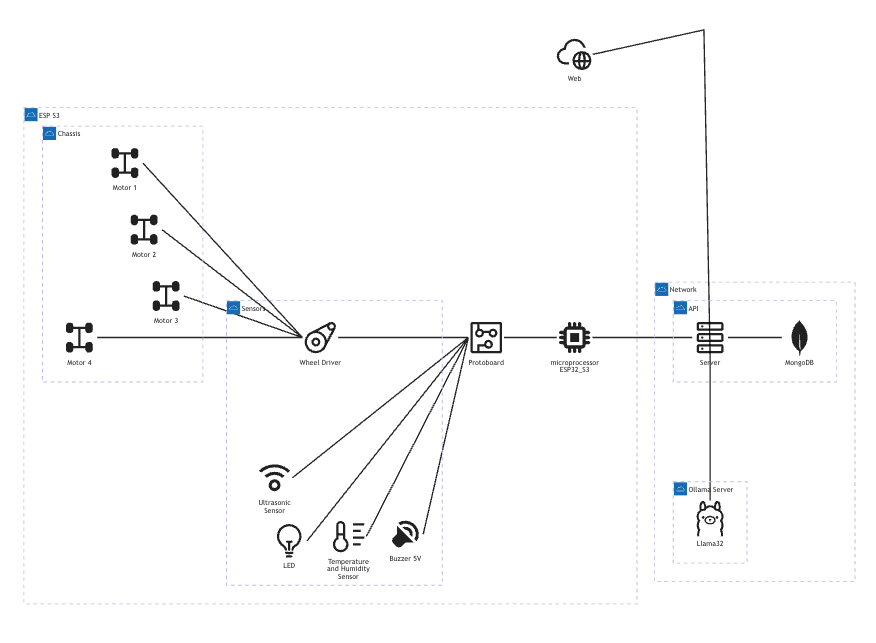
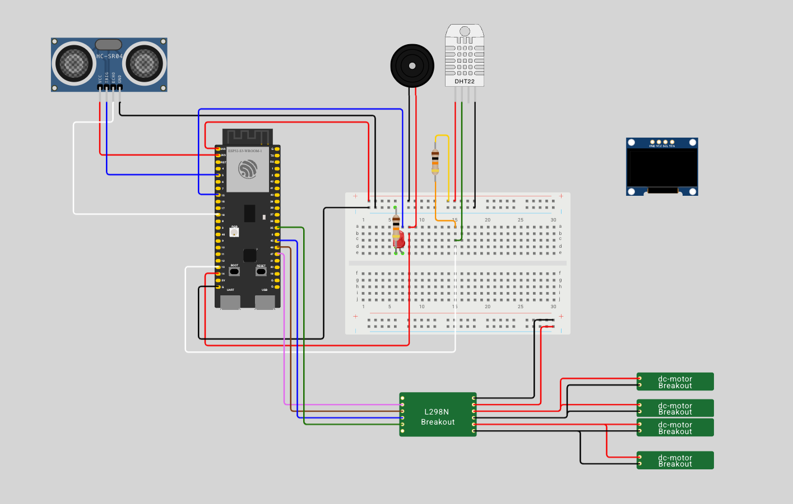

## Introduction

[{ align=right width=60% }](images/project/current_status_represenation.jpg){target="_bank"}


The project is a DIY project that uses a AI as the main controller. I create this project to test some ideas about how to create a robot that can be used to help in some tasks using AI. 

Current we use [ESP32-S3](https://www.espressif.com/en/products/socs/esp32s3) microcontroller to run the project with peripherals like camera, ultrasonic sensor, temperature and humidity sensor, etc.

[](https://github.com/glaucomunsberg/robot-ia/releases)
[](https://github.com/glaucomunsberg/robot-ia/releases)
[](https://github.com/glaucomunsberg/robot-ia/blob/main/LICENSE)
[](https://github.com/glaucomunsberg/robot-ia/actions/workflows/pages/pages-build-deployment)

<small>:information_source: It's a <b>early stage of development</b> and the robot is not able to move or take actions at this moment.</small>

<div class="grid-center" markdown>
[{ width="200" }](images/project/0.0.2/general/IMG_5008.jpg){ target="_blank" }
[{ width="200" }](images/project/0.0.2/general/IMG_5005.jpg){ target="_blank" }
[{ width="200" }](project/architecture.md)
[{ width="200" }](wiring/index.md)
</div>

## Project

### Structure

The project is structured in steps, each step has a folder with the documentation and the files to be used.

- **[Components](components/index.md)** all the hardwares components that are used in the project and the specifications of each component
- **[Assembly](assembly/index.md)** all the steps to assemble the robot
- **[Wiring](wiring/index.md)** all the steps to wire the robot sensors and actuators
- **[Programming](programming/index.md)** all the steps to program the robot to move, take actions and navigate through the environment

You can see the current [roadmap page](project/roadmap.md) and the features that are implemented in the [features page](project/features.md).

### Inspiration

The project was inspired by some projects and products that I admire, like [Wall-E Replica](https://wired.chillibasket.com/3d-printed-wall-e/){ target="_blank" }, [Otoodiy](https://www.ottodiy.com/){ target="_blank" } and the [Amazon Astro](https://www.amazon.com/Introducing-Amazon-Astro/dp/B078NSDFSB){ target="_blank" }. Thanks to all the creators that share their projects and ideas, it's a great inspiration for me to create this project.

### Progress

<div class="progress-bar-container">
    <div class="progress-bar" style="width: 18%;">18%</div>
</div>

Bellow you can see the current status of the project, if you want see the full list please go to the [features page](project/features.md).

- [x] Project structure and documentation
- [x] Project features and roadmap
- [ ] Creating the project components <small style='color:green'><b>:material-progress-clock: In Progress</b></small>
- [ ] Creating the project documentation  <small style='color:green'><b>:material-progress-clock: In Progress</b></small>
- [ ] Creating the project assembly <small style='color:green'><b>:material-progress-clock: In Progress</b></small>
- [ ] Create the project programming <small style='color:green'><b>:material-progress-clock: In Progress</b></small>
- [ ] Create the project 3D models
- [ ] Create the IA model
- [ ] Create the robot controller
- [ ] Create the robot interface

## Contribute

Fill free to contribute with this project! 

```bash
git clone https://github.com/glaucomunsberg/robot-ia.git
cd robot-ia
```

Fork the repository, create a new branch, make your changes and commit them, then create a pull request.

Keep in mind that you need follow the project [coding style](project/coding-style.md), and the project [documentation](project/documentation.md).

### License

This project is under the [GNU General Public License v2.0](https://github.com/glaucomunsberg/robot-ia/blob/main/LICENSE){ target="_blank" } it's a open source project and you can use it to create your own robot.

