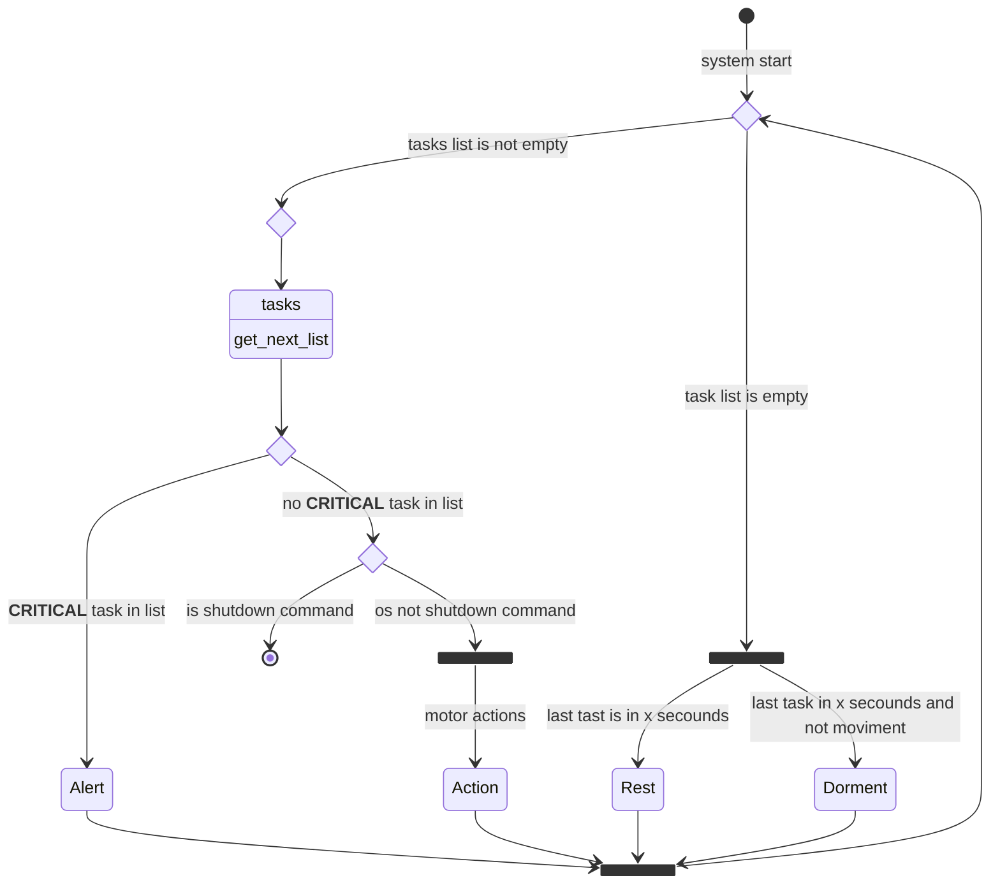

The system has a workflow that defines how the system behaves in each state. The workflow is defined by a state diagram that shows the system's behavior in each state.

```mermaid
stateDiagram
  direction TB
  state RestChoise <<choice>>
  state s1 <<join>>
  state s5 <<choice>>
  state s9 <<choice>>
  state s11 <<choice>>
  state s15 <<join>>
  state s16 <<join>>
  Alert --> s1
  s1 --> RestChoise
  [*] --> RestChoise:system start
  s2 --> s1
  s3 --> s1
  RestChoise --> s5:tasks list is not empty
  s5 --> s6
  s9 --> Alert:<b>CRITICAL</b> task in list
  s6 --> s9
  s11 --> [*]:is shutdown command
  s9 --> s11:no <b>CRITICAL</b> task in list
  s11 --> s15:os not shutdown command
  s15 --> s3:motor actions
  s16 --> s2:last tast is in x secounds
  RestChoise --> s16:task list is empty
  s16 --> s7:last task in x secounds and not moviment
  s7 --> s1
  s2:Rest
  s3:Action
  s6:tasks
  s6:get_next_list
  s7:Dorment
```