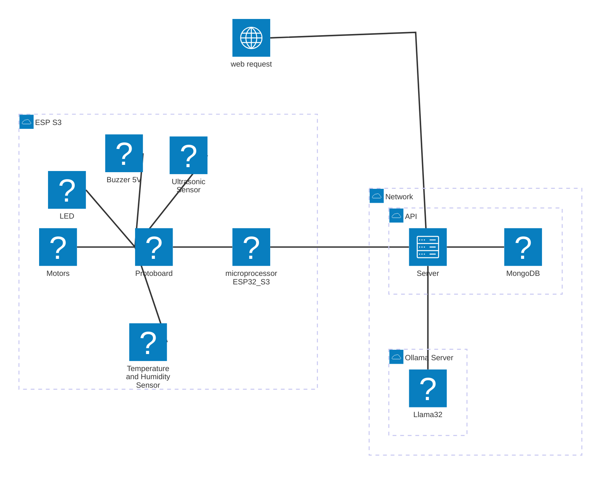

## behavior

```mermaid
architecture-beta
    group local(cloud)[Network]
    group api(cloud)[API] in local
    group olhama(cloud)[Ollama Server] in local
    group esp32s3(cloud)[ESP S3]

    %% Internet
    service gateway(internet)[web request]

    %% API SERVICES
    service mongoDB(lineicons:mongodb)[MongoDB] in api
    service serverAPI(server)[Server] in api

    %% OLLAMA SERVICES
    service ollamaModel(simple-icons:ollama)[Llama32] in olhama

    %% ESP32-S3 SERVICES
    service microprocessor(heroicons:cpu-chip-16-solid)[microprocessor ESP32_S3] in esp32s3
    service dh11(carbon:temperature-hot)[Temperature and Humidity Sensor] in esp32s3
    service hcsr04(ic:sharp-sensors)[Ultrasonic Sensor] in esp32s3
    service buzzer(material-symbols-light:sound-detection-loud-sound)[Buzzer 5V] in esp32s3
    service led(lets-icons:lamp)[LED] in esp32s3
    service breadboard(eos-icons:hardware-circuit)[Protoboard] in esp32s3
    service motors(game-icons:car-wheel)[Motors] in esp32s3

    %% connections IN ESP32-S3
    breadboard:R -- L:microprocessor
    dh11:R -- L:breadboard
    hcsr04:R -- L:breadboard
    buzzer:R -- L:breadboard
    led:R -- L:breadboard
    motors:R -- L:breadboard

    %% Connections 
    mongoDB:L -- R:serverAPI
    ollamaModel:T -- B:serverAPI
    microprocessor:R -- L:serverAPI

    serverAPI:B -- R:gateway
```
