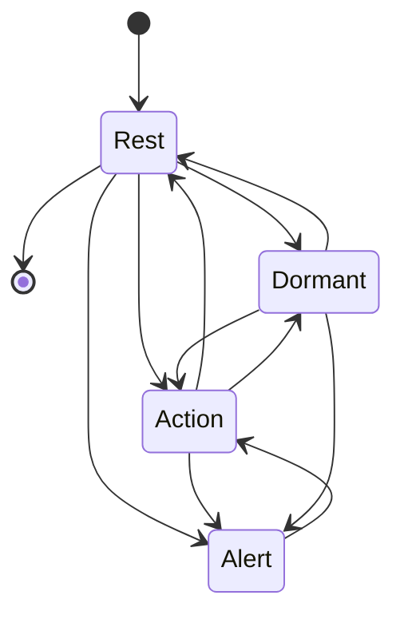
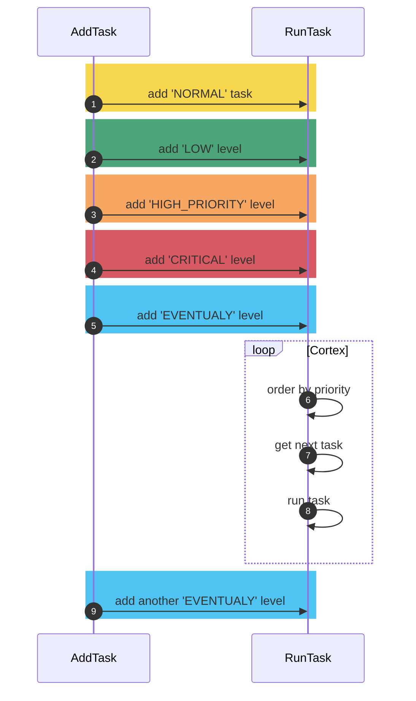

## Cortex

The `Cortex` is the brain of the system, responsible for managing all system activities, from reading sensors, controlling actuators, image processing, executing [commands](../protocols/intention/command.md), to communicating with other systems. Cortext use the [states](#states) to understand the system's current state and manage the [behavior](#behavior) of the system.

## States and Transition

The `Cortex` is responsible for managing the system's state, prioritizing tasks, and executing them according to the system's state. Each state has a set of rules that define when the system `enters` and `exits` the state and rules executed `during` the state. 

The system has four states called `Alert`, `Action`, `Rest`, and `Dormant`. The system transitions between states according to the system's activities and the tasks in the task queue.

### **Alert**

The robot prioritizing critical activities and suspending all non-critical activities.

- **Enter** when any critical activity is inserted in cortex task queue
- **During** suspend all sensor readings (TODO)
- **Exit** when all critical activities are executed

### **Action**

The robot executing all tasks in normal priority.

- **Enter** when the system receives a command to execute an action and any critical activity is in the cortex task queue
- **During** execute all tasks in the cortex task queue
- **Exit** when all tasks in the cortex task queue are executed

### **Rest**

The robot waiting for activities to be added to the task queue and not reading certain sensors.

- **Enter** without activities for x seconds
- **During** does not read certain sensors
- **Exit** with the addition of some activity

### **Dormant**

The robot waiting for the battery to be charged or the system to be restarted or ignore some set of sensors or commands.

- **Enter** General Dane or battery at critical level
- **During** does not read certain sensors (TODO)
- **Exit** system restarted or battery not at critical level

---
    
## Task Enqueue

Todas as trefas são enviadas para serem processada com a classificação:

- <small style='background-color: rgb(198,21,32);color: white; border-radius: 6px; padding: 1px 6px;'>**CRITICAL**</small>: Execução imediatamente na fila. Cenário: Cancelar todos os comandos de movimento pq foi detectada uma barreira a 10cm.
- <small style='background-color: rgb(246,130,32);color: white; border-radius: 6px; padding: 1px 6px;'>**HIGH PRIORITY**</small>: Execução com prioridade alta se não houver atividades críticas. Cenário: Leitura do sensor de distância enquanto o carro está em movimento.
- <small style='background-color: rgb(243,199,4);color: white; border-radius: 6px; padding: 1px 6px;'>NORMAL</small>: Execução em prioridade normal, caso não haja atividades de alta prioridade. Cenário: realizar o movimento do carro, leitura de outros sensores ou execução de demostrativo na tela.
- <small style='background-color: rgb(0,126,64);color: white; border-radius: 6px; padding: 1px 6px;'>LOW</small>: atividades de baixa prioridade, caso não haja nenhuma atividade: Cenário: leitura de sensores secundários como de tempoeratura, sincronização de de dados e etc.
- <small style='background-color: rgb(5,172,237);color: white; border-radius: 6px; padding: 1px 6px;'>EVENTUALY</small>: Atividades que não exigem priorização e poderão não ser executadas. Cenário: sincronização do relógio interno.

Below is a sequence diagram that shows how the tasks are enqueued and processed by the `Cortex`.

