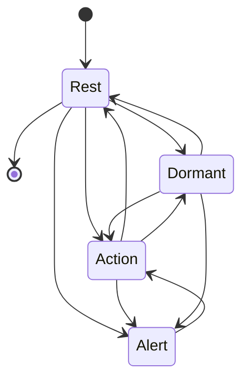
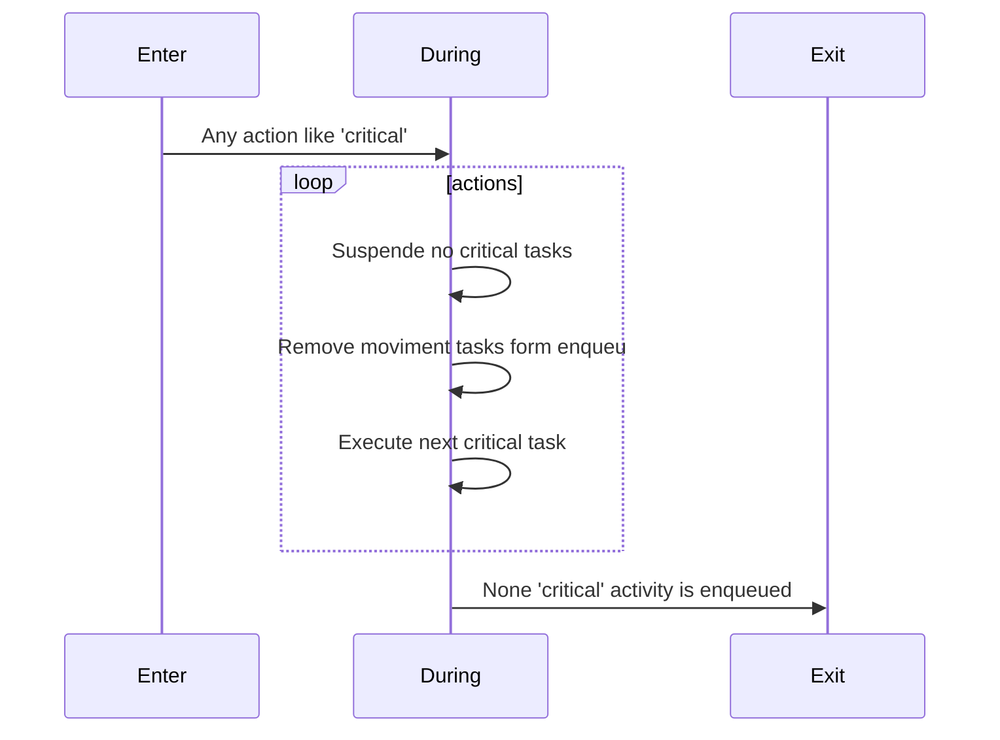
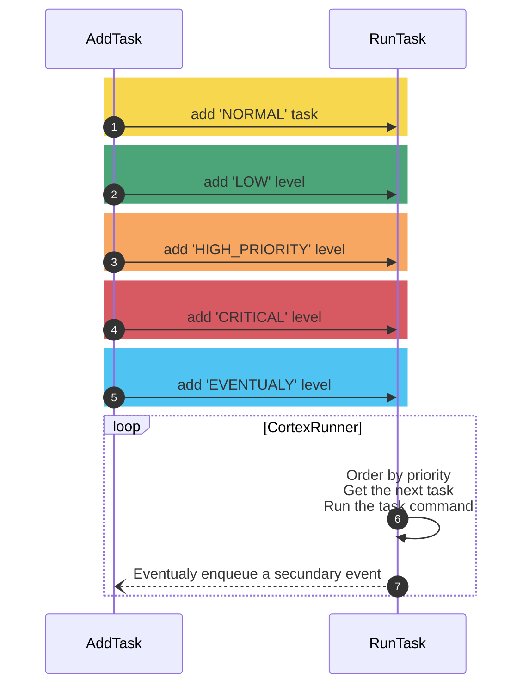

## Cortex

The `Cortex` is the brain of the system, responsible for managing all system activities, from reading sensors, controlling actuators, image processing, executing commands, to communicating with other systems.

## States

The `Cortex` is responsible for managing the system's state, prioritizing tasks, and executing them according to the system's state. The system has four states:

- **Alert**: The system is in alert mode, waiting for a critical activity to occur.
- **Action**: The system is in action mode, executing tasks.
- **Rest**: The system is in rest mode, waiting for activities to occur.
- **Dormant**: The system is in dormant mode, waiting for the battery to be charged or the system to be restarted.

### Alert

- **Enter** when any critical activity is inserted in cortex task queue
- **During** suspend all sensor readings (TODO)
- **Exit** when all critical activities are executed

### Action
- **Enter** when the system receives a command to execute an action and any critical activity is in the cortex task queue
- **During** execute all tasks in the cortex task queue
- **Exit** when all tasks in the cortex task queue are executed

### Rest

- **Enter** without activities for x seconds
- **During** does not read certain sensors
- **Exit** with the addition of some activity

### Dormant 

- **Enter** General Dane or battery at critical level
- **During** does not read certain sensors (TODO)
- **Exit** system restarted or battery not at critical level

## Transition

Each state has a set of rules that define when the system `enters`, `during`, and `exits` the state.

### Enter

The system enters the state when a specific activity occurs.

### During

The system remains in the state/rules while a specific activity occurs.

### Exit

The system exits the state when a specific activity occurs.

    
## Task Enqueue

Todas as trefas são enviadas para serem processada com a classificação:

- <small style='background-color: rgb(198,21,32);color: white; border-radius: 6px; padding: 1px 6px;'>**CRITICAL**</small>: Execução imediatamente na fila. Cenário: Cancelar todos os comandos de movimento pq foi detectada uma barreira a 10cm.
- <small style='background-color: rgb(246,130,32);color: white; border-radius: 6px; padding: 1px 6px;'>**HIGH PRIORITY**</small>: Execução com prioridade alta se não houver atividades críticas. Cenário: Leitura do sensor de distância enquanto o carro está em movimento.
- <small style='background-color: rgb(243,199,4);color: white; border-radius: 6px; padding: 1px 6px;'>NORMAL</small>: Execução em prioridade normal, caso não haja atividades de alta prioridade. Cenário: realizar o movimento do carro, leitura de outros sensores ou execução de demostrativo na tela.
- <small style='background-color: rgb(0,126,64);color: white; border-radius: 6px; padding: 1px 6px;'>LOW</small>: atividades de baixa prioridade, caso não haja nenhuma atividade: Cenário: leitura de sensores secundários como de tempoeratura, sincronização de de dados e etc.
- <small style='background-color: rgb(5,172,237);color: white; border-radius: 6px; padding: 1px 6px;'>EVENTUALY</small>: Atividades que não exigem priorização e poderão não ser executadas. Cenário: sincronização do relógio interno.

Below is a sequence diagram that shows how the tasks are enqueued and processed by the `Cortex`.

