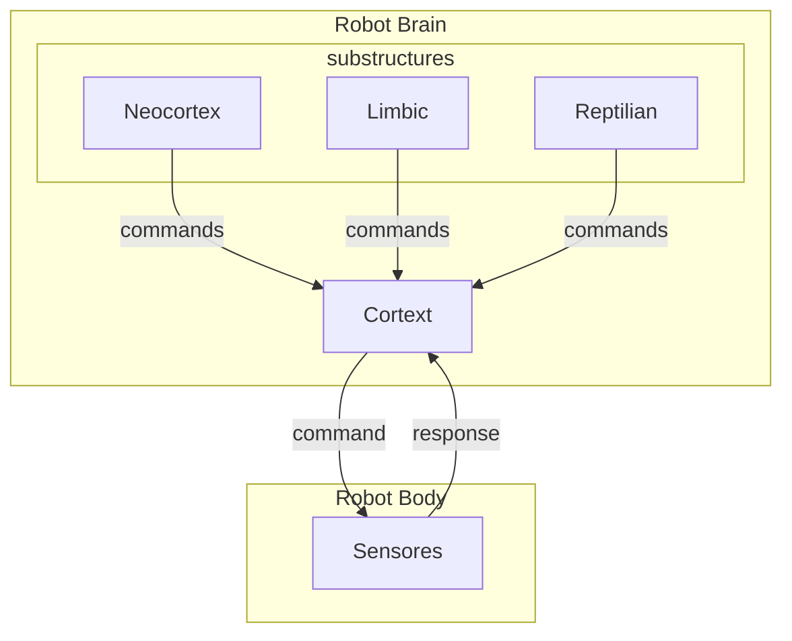
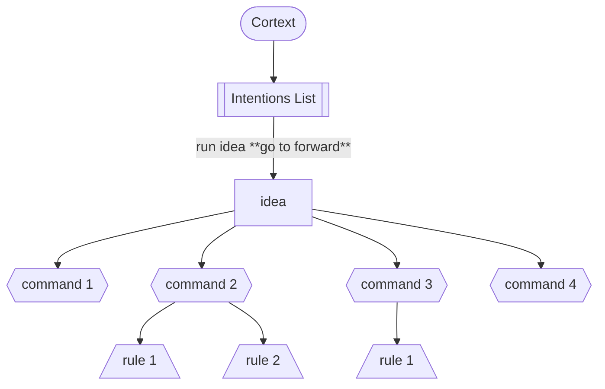

The abstract processor worflow is the **brain** in the robot-ia.

It's [structured](structure.md) by [cortex](cortex.md) and substructures like [reptilian](reptilian.md), [limbic](limbic.md) and [neocortex](neocortex.md) to execute actions, decisions and manage the robot's [behavior](behavior.md). Each executation in brain use the [protocols](../protocols/index.md) to communicate, translate commands and return responses.

## Brain Workflow Runner

The brain execute the intentions in cortex translating the commands to the sensors and actuators. Bellow an exemple to read ultrassonic sensor and move the robot forward.

