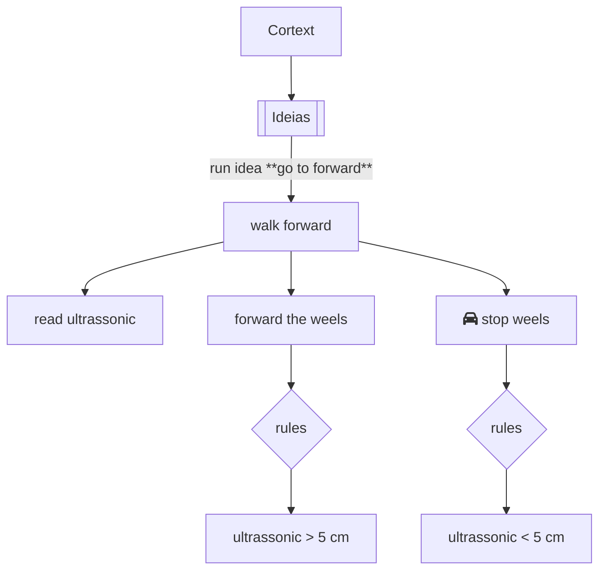

The brain is **[STRUCTURED](structure.md)** by **[CORTEX](cortex.md)** that run all **[INTENTIONS](../protocols/intention/index.md)** with your **[COMMANDS](../protocols/intention/command.md)**. All data to send/used in each idea use the **[PROTOCOL](../protocols/index.md)**. 

The workflow of the idea running in the robot Cortex is represented in the flowchart below.

