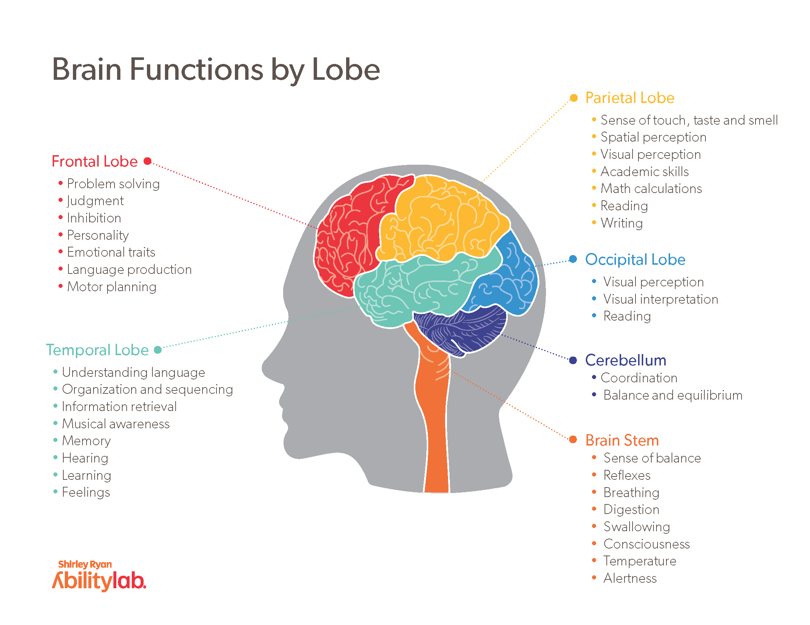

## Triune brain

The architecture of the robot brain is divided into three main parts: the [reptilian brain](#reptilian), the [limbic brain](#limbic), and the [neocortex](#neocortex). Each part has its own responsibilities and characteristics to allow the robot to interact with the environment and make decisions based on the environment.

**Reptilian Brain** is divided into two [Brain Steam](#brain-steam) and [Cerebellum](#cerebellum), the **Limbic Brain** is divided into two [Temporal Lobe](#temporal-lobe) and [Occipital Lobe](#occipital-lobe) and the **Neocortex** is divided into two [Frontal Lobe](#frontal-lobe) and [Parietal Lobe](#parietal-lobe)

Below is the architecture of the robot brain:

```mermaid

architecture-beta
    group brain(hugeicons:ai-brain-01)[Brain]

    group reptilian(hugeicons:ai-brain-05)[Reptilian] in brain
    group limbic(hugeicons:ai-brain-05)[Limbic] in brain
    group neocortex(hugeicons:ai-brain-05)[Neocortex] in brain

    service brainSteam(hugeicons:ai-brain-04)[Brain Steam] in reptilian
    service cerebellum(hugeicons:ai-brain-04)[Cerebellum] in reptilian

    service temporalLobe(hugeicons:ai-brain-04)[Temporal Lobe] in limbic
    service occipitalLobe(hugeicons:ai-brain-04)[Occipital Lobe] in limbic

    service frontalLobe(hugeicons:ai-brain-04)[Frontal Lobe] in neocortex
    service parietalLobe(hugeicons:ai-brain-04)[Parietal Lobe] in neocortex

    service cortex(hugeicons:flowchart-02)[Cortex] in brain 


    cortex:T -- B:parietalLobe
    cortex:T -- B:frontalLobe

    cortex:B -- T:cerebellum
    cortex:B -- T:brainSteam

    cortex:L -- R:temporalLobe
    cortex:L -- R:occipitalLobe



```

### Reptilian

Responsable for the instinctive and basic functions of the robot.

**Responsibilities** 

The reptilian brain is responsible for the robot's basic functions and work when the robot is in the `Rest` state or not receiving any commands from limbic or neocortex. 

**Scenario** 

Connection with server is offline, the reptilian brain will keep the robot in the `Rest` state and will manage the battery and sensors.

#### Brain Steam 

Responsible for the basic functions of the robot, such as reading sensors, controlling actuators, and managing the battery. The reptilian brain is responsible for the robot's survival and basic functions.

#### Cerebellum

----

### Limbic

The limbic brain is responsible for the robot's emotional state and the robot's interaction with the environment.

**Responsibilities**

The limbic brain is responsible for the robot's "emotional state" and the robot's interaction with the environment.

**Scenario** 
The robot is in the `Rest` state and receives a command to move forward, the limbic brain will change the robot's state to `Action` and execute the command.

#### Temporal Lobe

#### Occipital Lobe

----

### NeoCortex

The neocortex is responsible for the robot's cognitive functions, such as image processing, decision making, and communication with other systems. The most part of the robot's intelligence is in the neocortex and is responsible for the robot's learning and decision-making process based on the environment.

The most part of the **"cognitive functions"** of the robot are inside the Server API and the Ollama Server, the neocortex is responsible for managing the communication between the robot and the servers.

**Responsibilities** 
    
The neocortex is responsible for the robot's cognitive functions, such as image processing, decision making, and communication with other systems. The most part of the robot's intelligence

**Scenario** 

The robot is in the `Action` state and receives a command to take a picture, the neocortex will process the image and send the result to the server.

#### Frontal Lobe

#### Parietal Lobe

----

## Human System Design

[{ align=right width=200 }](../../images/programming/brain/brain_lobes.png){target=_blank}

The robot brain is inspired by the human brain, the robot brain is divided into three main parts: the reptilian brain, the limbic brain, and the neocortex. Each part has its own responsibilities and characteristics. Lobes of the brain are responsible for different functions and are connected to each other and the abstract lobes are used to organize this robot brain architecture.

---

This section show abstract concepts about the brain architecture, the next sections will show the robot brain architecture and the components used in the robot brain.

-   :material-brain:{ .lg .middle } __Cortex__

    ---

    More about the *tasks running* and pipeline in the robot brain

    [:octicons-arrow-right-24: Cortex Section](cortex.md)

-   :material-brain:{ .lg .middle } __Behavior__

    ---

    More about the *robot behavior* and *tasks* in the robot brain

    [:octicons-arrow-right-24: Behavior Section](behavior.md)

