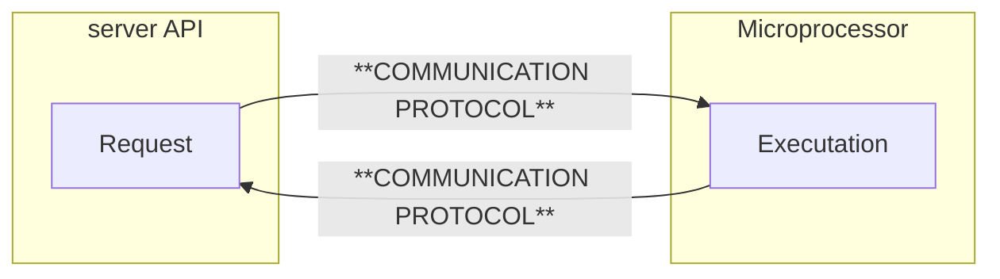
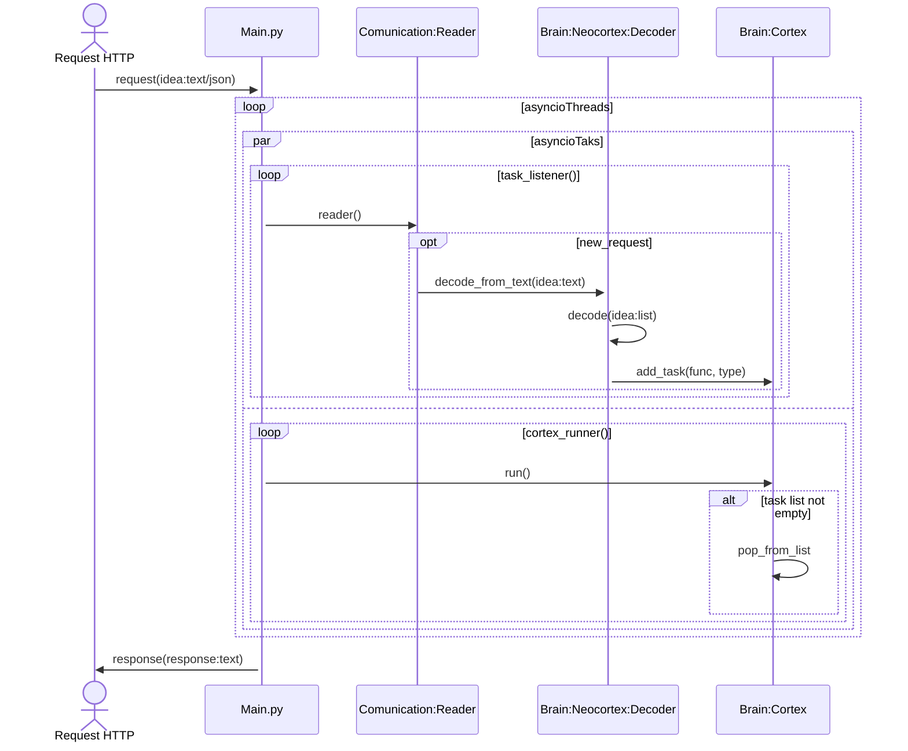

# Communication

## Description

Communication is the process of exchanging information between two or more entities. It is a fundamental concept in programming, as it is the basis for all interactions between Server through the [Intention](../intention/index.md) and a Robot Cortex through the [Brain](../../brain/index.md).

## Diagram

Below is a sequence diagram that shows the communication between the server intention and the actions of the robot cortex.

