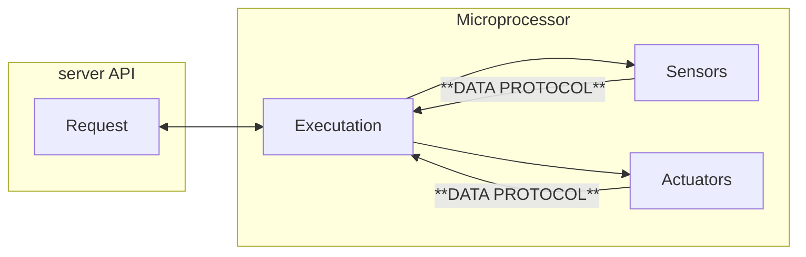

## Introduction

The robot sends the sensors data to the controller in a json format and this data can be used to monitor the robot's environment, status, etc. The data is sent in a json format and the controller can use this data to monitor the robot's environment and status.

Current the data protocol is composed by [**sensor data**](sensor.md) and [**actuator data**](sensor.md).



## Example

The robot sends the sensors data to the controller in a json format and this data can be used to monitor the robot's environment and status, below is an example of the data sent from ultrasonic sensor to the controller.

```json
{
    "sensors": {
        "ultrasonic": {
            "distance": 10,
            "unit": "cm",
            "created_at": "2021-01-01T00:00:00"
        }
    }
}
```

---

You can read more about the [sensors data](sensor.md) and [actuators data](sensor.md) in the specific page.