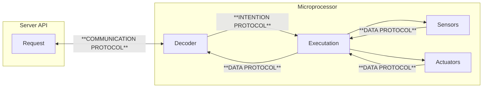

# Communication Protocol

Communication is the process of exchanging information between two or more entities. It is a fundamental concept in programming, as it is the basis for all interactions between different parts of a system such as a Server Intention and a Robot Cortex.

Current the project is composed by the communication between the [server and the robot](#server-communication), the [robot and the sensors and actuators](#robot-intention), and the [data syntax](#data-syntax) used or returned by the robot.

## Communication protocol

Communication between the server and the robot is done through the HTTP protocol. The server sends the robot an idea in JSON format, and the robot sends the server a response in JSON format.

  [Read more about Communication Protocol](communication/index.md){ .md-button }

## Intention Protocol

Communication between the robot and the sensors and actuators is done through intentions. The robot sends an intention to the sensors and actuators, and the sensors and actuators send a response to the robot.

  [Read more about Intention Protocol](intention/index.md){ .md-button }

## Data Protocol

All data used in the communication between the server and the robot is in JSON format. The data use a format create by data syntax section.

  [Read more about Data Protocol](data/sensor.md){ .md-button }

