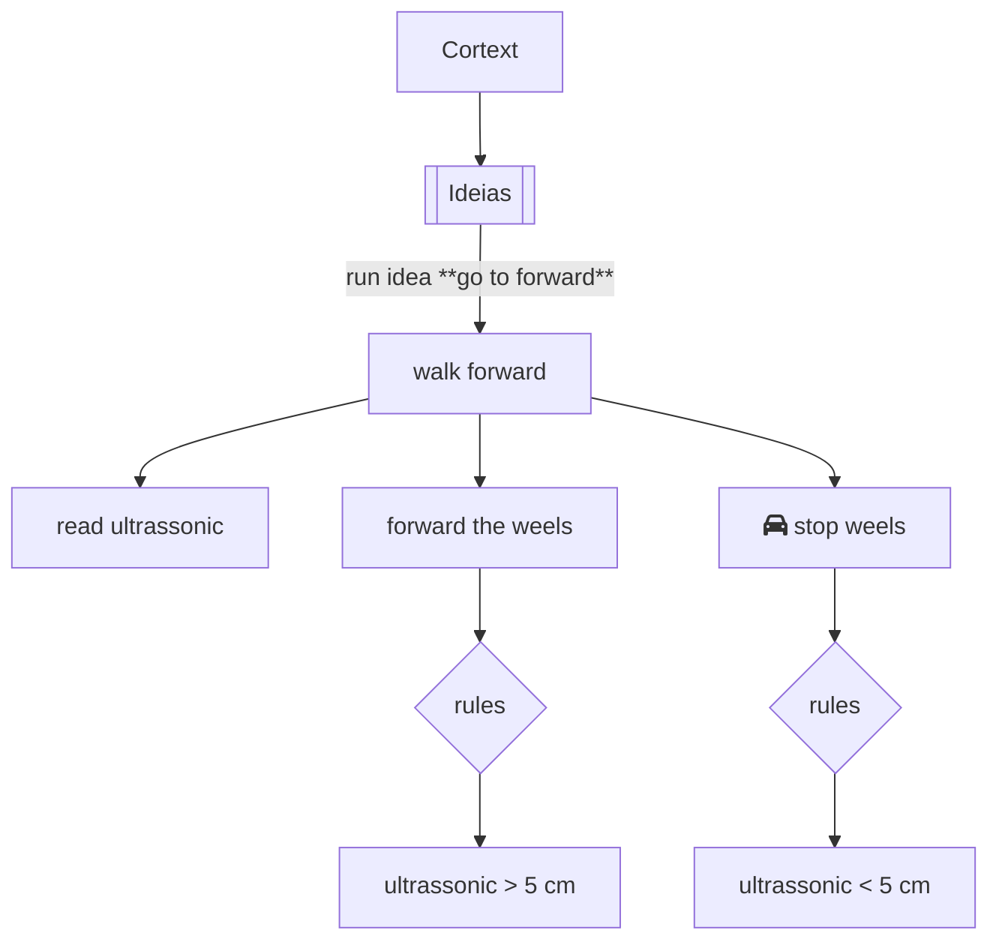

## Example

"I want move until find a wall" is an `idea` and that idea can be translated to a list with `command` and `rules` to the robot go to foward. Lets construct the idea, commands and rules to the robot go ahead.

### Ideia

The wil be composed by a `name` and a `description` to the idea is a text field that describes the idea.

```json
{
  "idea": {
    "name": "go to forward",
    "description": "I want to start walking until I find a wall",
    "commands": []
  }
}
```

### Commands

The commands are the actions that the robot must execute to reach the goal. At this moment, the commands are composed by: Read sensors, move the weel to the forward direction and stop the weel.

```json
{
  "commands": [
    {
        "sensors": {
            "ultrasonic": {
                "action": "read"
            }
        }
    },
    {
        "actuators": [
            {
                "weel": {
                    "action": "forward",
                    "speed": 100,
                    "weels": {
                        "left": 100,
                        "right": 100
                    }
                }
            },
            {
                "weel": {
                    "action": "stop",
                    "speed": 0,
                    "weels": {
                        "left": 0,
                        "right": 0
                    }
                }
            }
        ]
    }
  ]
}
```

### Rules

Well, we need to create a rules to when the robot must forward or stop. At this case we create a rule to stop the robot when the ultrasonic sensor detect a wall at 5 cm and keep the robot moving until the ultrasonic sensor detect a wall at 5 cm.

```json
{
  "actuators": [
    {
      "weel": {
        "action": "forward",
        "speed": 100,
        "weels": {
          "left": 100,
          "right": 100
        },
        "rules": [
          {
            "sensors": {
              "ultrasonic": {
                "distance": 5,
                "unit": "cm",
                "condition": "less_than"
              }
            }
          }
        ]
      }
    },
    {
      "weel": {
        "action": "stop",
        "speed": 0,
        "weels": {
          "left": 0,
          "right": 0
        },
        "rules": [
          {
            "sensors": {
              "ultrasonic": {
                "distance": 5,
                "unit": "cm",
                "condition": "greater_than"
              }
            }
          }
        ]
      }
    }
  ]
}
```


### Data

In some cases the robot can read the sensors and this data follow the [sensors syntax](../data/sensor.md). Bellow you will find the complete json  with the data from current read ultrasonic sensor.

```json
{
  "sensors": {
    "ultrasonic": {
      "distance": 10,
      "unit": "cm"
    }
  }
}
```

## Result

The result of protocol is a json file that you will use to send in [API](../../API/index.md) and the API send this command to the [Cortex](../../brain/cortex.md) to be run.


### Format

Bellow you will find the complete json file with the idea, commands and rules to the robot go to forward.

```json
{
  "name": "go to forward",//(1)
  "description": "I want to start walking until I find a wall",
  "commands": [ //(2)
    {
        "sensors": { //(3)
            "ultrasonic": {
                "action": "read"
            }
        }
    },
    {
        "actuators": [ //(4)
            {
                "weel": {
                    "action": "forward",
                    "speed": 100,
                    "weels": {
                        "left": 100,
                        "right": 100
                    },
                    "rules": [ //(5)
                        {
                            "sensors": {
                                "ultrasonic": {
                                    "distance": 5,
                                    "unit": "cm",
                                    "condition": "less_than"
                                }
                            }
                        }
                    ]
                }
            },
            {
                "weel": {
                    "action": "stop",
                    "speed": 0,
                    "weels": {
                        "left": 0,
                        "right": 0
                    },
                    "rules": [ //(6)
                        {
                            "sensors": {
                                "ultrasonic": {
                                    "distance": 5,
                                    "unit": "cm",
                                    "condition": "greater_than"
                                }
                            }
                        }
                    ]
                }
            }
        ]
    }
  ]
}
```

1. `idea` is composed by a `name` and a `description` to the idea is a text field that describes the idea.

2. `commands` is composed by a list of command. To the robot go foward we need to read the ultrasonic sensor, move the weel to the forward direction and stop the weel.

3. A command to read the sensor ultrasonic.

4. A command to move the weel to the forward direction and stop the weel.

5. The rules to keep forward. This rule is compose by a condiction that is the ultrasonic sensor not detect a wall at 5 cm

6. The rules to stop the robot. This rule is composed when the ultrasonic sensor detect a wall at 5 cm.

### Workflow

The workflow of the idea running in the robot Cortex is represented in the flowchart below.

