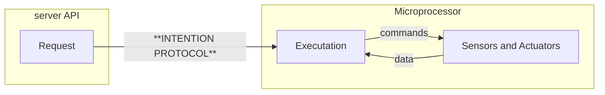
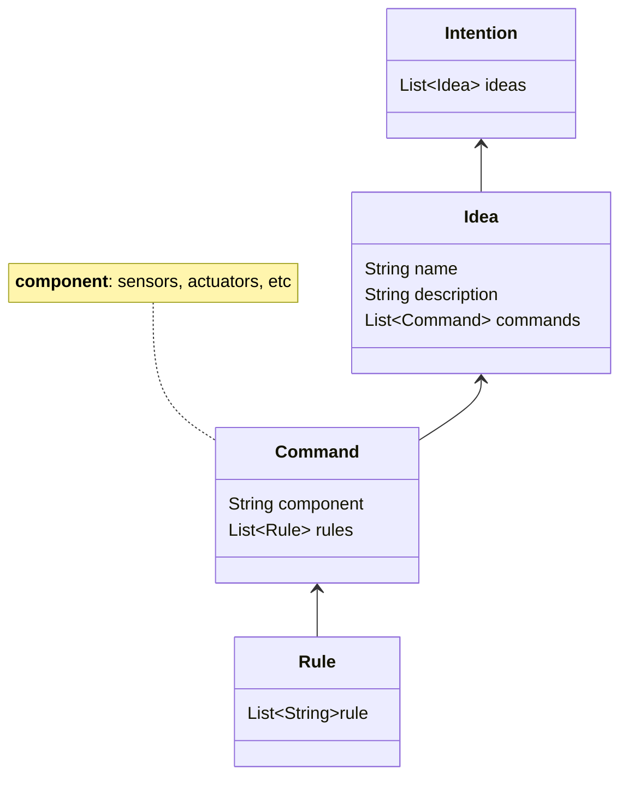
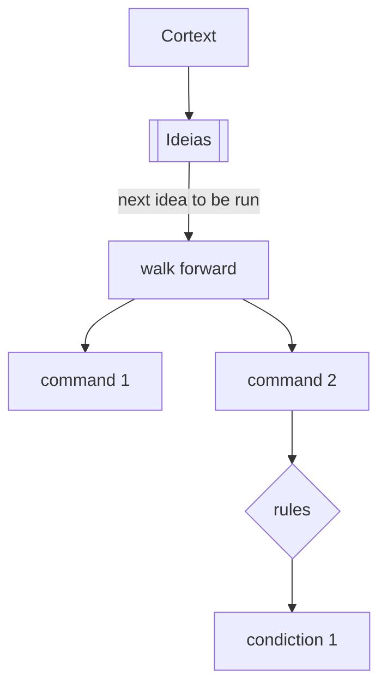

# Intentions

## Introduction

The robot communication protocol is a set of rules that the robot and the controller must follow to communicate called Intentions. The protocol is the base to translate the robot's idea to the robot's actions.



We use the concept of [`idea`](idea.md) to represent the data that the robot sends to the controller, the concept of [`command`](command.md) to represent the commands that the controller sends to the robot with conecept of [`rules`](rule.md) to represent condictions to run commands or abort a idea in executation. In some cases, the robot can send the [data](../data/sensor.md) from sensors to the controller to be stored in a database.




### Workflow execution

Each **idea** is running in the robot through the [`cortex`](../../brain/cortex.md) and the robot sends the data to the controller. The controller sends the commands to the robot to execute the idea. 




### Format

We use a [json syntax](https://www.json.org/json-en.html){ target='\_blank' } protocol to communicate between the robot and the controller. The robot sends the data to the controller and the controller sends the commands to the robot. Below is a general format of the data that the robot sends to the controller.

```json
{
  "idea": {
    "name": "",
    "description": "",
    "commands": [
        {
            "command_1": [
                {
                    "component_name": {
                        "rules": [ ]
                    }
                }
            ]
        }
    ]
  }
}
```

You can find more information about the syntax in the [idea](idea.md), [command](command.md) and [rule](rule.md) pages.

---

This section show abstract concepts about the communication protocol, the next sections will show the robot communication protocol and the components used in the robot communication protocol.

<div class="grid cards" markdown>

-  :material-code-block-tags:{ .lg .middle } __An Example__

    ----

    See a example of the robot communication protocol and the components used in the protocol.

    [:octicons-arrow-right-24: Example Section](example.md)

-   :octicons-light-bulb-16:{ .lg .middle } __Idea__

    ----

    More about the *idea* and *goals* to be reached by the robot. Learn more about the syntax and the structure of the idea.

    [:octicons-arrow-right-24: Idea Section](idea.md)

-   :octicons-command-palette-16:{ .lg .middle } __Command__

    ----

    More about the *robot commands* and *actions* to reach the goal. Learn more about the `sensors` and `actuators` commands.

    [:octicons-arrow-right-24: Command Section](command.md)

-   :material-directions-fork:{ .lg .middle } __Rules__

    ----

    More about the *robot rules* and *conditions*  to each command. Learn more about the logical `condition` that run the command

    [:octicons-arrow-right-24: Rule Section](rule.md)

</div>
