# High Level Components Architecture

The architecture of the project is divided into three main components, the **API**, the **Ollama Server**, and the **ESP32-S3**. 

```mermaid
architecture-beta
    group local(cloud)[Network]
    group api(cloud)[API] in local
    group olhama(cloud)[Ollama Server] in local
    group esp32s3(cloud)[ESP S3]
    group sensors(cloud)[Sensors] in esp32s3
    group chassis(cloud)[Chassis] in esp32s3

    %% Internet
    service gateway(carbon:network-public)[Web]

    %% API SERVICES
    service mongoDB(simple-icons:mongodb)[MongoDB] in api
    service serverAPI(carbon:bare-metal-server)[Server] in api

    %% OLLAMA SERVICES
    service ollamaModel(simple-icons:ollama)[Llama32] in olhama

    %% ESP32-S3 SERVICES
    service breadboard(codicon:circuit-board)[Protoboard] in esp32s3
    service microprocessor(heroicons:cpu-chip-16-solid)[microprocessor ESP32_S3] in esp32s3
    service dh11(carbon:temperature)[Temperature and Humidity Sensor] in sensors
    service hcsr04(material-symbols:nest-remote-comfort-sensor-outline)[Ultrasonic Sensor] in sensors
    service buzzer(material-symbols:sound-detection-loud-sound)[Buzzer 5V] in sensors
    service led(heroicons:light-bulb)[LED] in sensors
    service wheelDriver(carbon:asset)[Wheel Driver] in sensors
    service motor1(solar:wheel-angle-bold-duotone)[Motor 1] in chassis
    service motor2(solar:wheel-angle-bold-duotone)[Motor 2] in chassis
    service motor3(solar:wheel-angle-bold-duotone)[Motor 3] in chassis
    service motor4(solar:wheel-angle-bold-duotone)[Motor 4] in chassis

    %% connections IN ESP32-S3
    breadboard:R -- L:microprocessor
    dh11:R -- L:breadboard
    hcsr04:R -- L:breadboard
    buzzer:R -- L:breadboard
    led:R -- L:breadboard
    wheelDriver:R -- L:breadboard
    motor1:R -- L:wheelDriver
    motor2:R -- L:wheelDriver
    motor3:R -- L:wheelDriver
    motor4:R -- L:wheelDriver

    %% Connections 
    mongoDB:L -- R:serverAPI
    ollamaModel:T -- B:serverAPI
    microprocessor:R -- L:serverAPI

    serverAPI:B -- R:gateway
```

## Responsibilities

#### Server

The Server is responsible for managing the communication between the microcontroller, API and the Ollama Server.

### API

The API is responsible for managing the data and sending the data taskes to ESP32-S3.

#### MongoDB

The MongoDB is responsible for storing the datalake data used by the API and the Ollama Server.

### Olhama Server

The Ollama Server is responsible for managing the data and the communication between the API and the ESP32-S3. 

#### Llama32 model

The model is responsible for generate tasks and send to [Brain Cortex](../programming/brain/cortex.md) in microprocessor ESP32-S3.

### ESP32-S3

The ESP32-S3 is responsible for executing the tasks generated by the Llama32 model and send the data to the sensors and actuators.