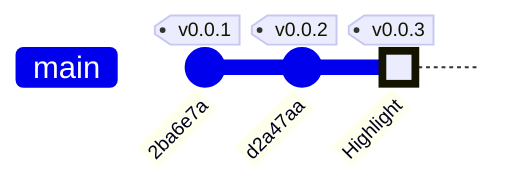

## Current Version
The current version of the project is v0.0.3. The project is in progress and the next steps are to connect the motors and the motor driver, and start the brain and cortex programming.

##

## List of versions

### v0.0.3 <small>(In Progress)</small>

- Project
    - Diagram General Architecture 
    - Improving Components
    - Adding behavior 
- Wiring
    - Connecting wheels motors
    - Connecting motor driver
- Programming
    - Start brain and cortex programming

### v0.0.2

- Project
    - Features
    - Roadmap
- Components
    - Improving documentation and list
- Wiring
    - Connecting temperature and humidity sensor
    - Connecting ultrasonic sensor
    - Connecting buzzer
    - Connecting LED

### v0.0.1 

- Project
    - Start project documentation
    - List as components
    - List as buying list
- Assembly
    - Assemble the chassis
    - Assemble the motors and wheels

You can see all versions in [github page releases](https://github.com/glaucomunsberg/robot-ia/releases){ target="_blank" }.