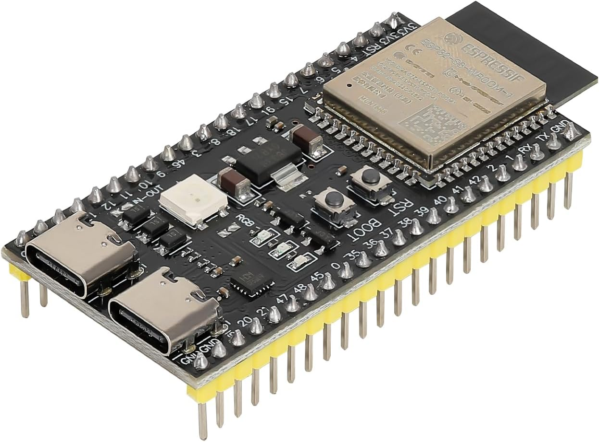

# Resume

{ align=right width="300" }

This section summarizes how to prepare, configure, and run Robot AI on an ESP32‑S3, with links to detailed steps.

### What you’ll set up

- ESP‑IDF v5.3.2 toolchain and required OS packages
- MicroPython (including `mpy-cross`)
- Optional IDE/tools (Thonny/Tk)
- ESP32‑S3 firmware (MicroPython) flashed via `esptool.py`
- Project configuration via `robot-ai.json` (Wi‑Fi, WebREPL, API)

### Quick steps

1) Environment: follow platform prerequisites, install ESP‑IDF v5.3.2, add `get_idf` alias, install `esptool` and helpers, and build `mpy-cross`.  
   See: [Setup Environment](environment.md)

2) Flash firmware: erase and write the MicroPython image for ESP32‑S3.  
   Firmware used: `ESP32_GENERIC_S3-20241129-v1.24.1.bin`.  
   See: [Setup Environment](environment.md#upgrade-de-esp32-s3-firmware)

3) Configure: edit `robot-ai.json` with essentials:  
   - `name`, `description`, `version`, `debug`  
   - `configs.time` (timezone/offset)  
   - `configs.communication.web_repl.enabled`  
   - `configs.communication.wifi` (`ssid`, `password`, optional `ip/subnet/gateway/dns`)  
   - `configs.api.server.port`  
   See: [Configuration](config.md)

4) Run: from the project root, execute the helper script to transfer files and start the app:  
   - `./start_robot_ia.sh`  
   See: [Run Robot AI](run_robot_ai.md)

### Advanced (optional)

- Manual sync and run with `mpremote`:
  - `mpremote fs cp -r application :/`
  - `mpremote run application/main.py`  
  See: [Sync Files](advanced/sync.md)
- WebREPL: enable in `robot-ai.json` and access at `http://<ESP32-S3_IP>:8266`.  
  See: [Sync Files](advanced/sync.md#webrepl)
- Developer workflow: VS Code + direct run with `mpremote`.  
  See: [Advanced for Developers](advanced/dev.md)
