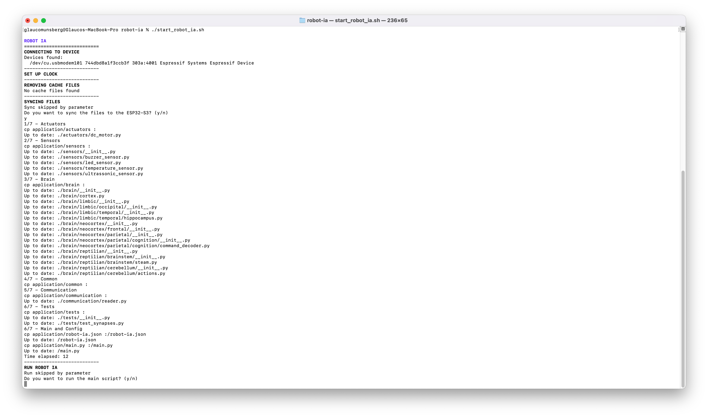

# Run Robot AI


## Execute the application


Go to the root of the project

```bash
cd robot-ai
```


Execute the start_robot_ia.sh script to send all environment files and start the robot_ia environment

```bash
./start_robot_ia.sh
```

[](../images/setup/terminal.png){ target="_blank" }


You should confirm the transfer of files, after that the application will run automatically.


!!! note "Note"
    Before this step, you need to install execute the stpe [Setup Environment](environment.md) to install the dependencies and [config](config.md) the environment.

!!! tip "Tip"
    Transfer Files to ESP32-S3 and run the application. We use the [mpremote](https://docs.micropython.org/en/latest/reference/mpremote.html){ target="_blank" } tool to transfer files to the ESP32-S3, feel free to use any other tool you prefer.


---

If you whant to run the application in dev mode, please go to the [advanced](advanced/sync.md) section.