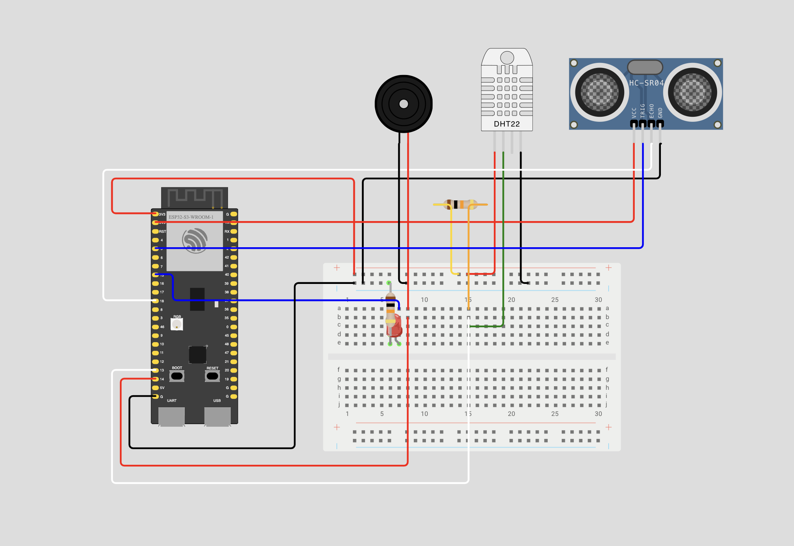

# Wiring

## Current Status <small>(alpha version)</small>

You can follow the wiring diagram below to connect the components to the ESP32-S3 in [**wokwi**](https://wokwi.com/projects/424959675990984705){ target="_blank" }. The wiring diagram is interactive, you can click on it to see the full size image and zoom in.
 

To see all components installed in the breadboard see the [roadmap](../project/roadmap.md) of the project.

## Examples 

The wiring diagrams below show how to connect the components to the ESP32-S3. The wiring diagrams was based on the below examples:

### ESP32 with DHT11/DHT22 <small>(alpha version)</small>

The ESP32 is a microcontroller that can be programmed to read data from the DHT11 sensor.

{ width=75% }

Code example:

[https://randomnerdtutorials.com/esp32-esp8266-dht11-dht22-micropython-temperature-humidity-sensor/](https://randomnerdtutorials.com/esp32-esp8266-dht11-dht22-micropython-temperature-humidity-sensor/){ target="_blank" }

### Ultrasonic Sensor HC-SR04 with Display <small>(alpha version)</small>

The HC-SR04 is a ultrasonic sensor that can be used to measure the distance to an object.

{ width=75% }

Code example:

[https://randomnerdtutorials.com/esp32-hc-sr04-ultrasonic-arduino/](https://randomnerdtutorials.com/esp32-hc-sr04-ultrasonic-arduino/){ target="_blank" }

### Led 5mm

The LED 5mm is a light emitting diode that can be used to indicate the status of the robot.

{ width=75% }

Code exemple:

[https://dev.to/shemanto_sharkar/micropython-esp32-blink-led-210d](https://dev.to/shemanto_sharkar/micropython-esp32-blink-led-210d){ target="_blank" }

### Buzzer 5v 12mm

Melody

{ width=75% }

[https://micropython-on-wemos-d1-mini.readthedocs.io/en/latest/basics.html#beepers](https://micropython-on-wemos-d1-mini.readthedocs.io/en/latest/basics.html#beepers){ target="_blank" }

### Driver H L298N

{ width=49% }

{ width=49% }

[https://randomnerdtutorials.com/esp32-dc-motor-l298n-motor-driver-control-speed-direction/](https://randomnerdtutorials.com/esp32-dc-motor-l298n-motor-driver-control-speed-direction/){ target="_blank" }

[https://randomnerdtutorials.com/micropython-esp32-esp8266-dc-motor-l298n/](https://randomnerdtutorials.com/micropython-esp32-esp8266-dc-motor-l298n/){ target="_blank" }