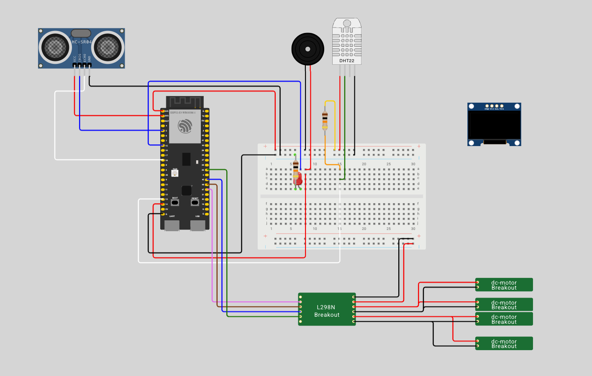
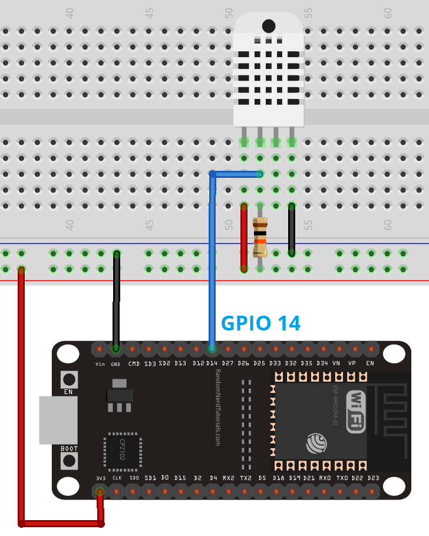
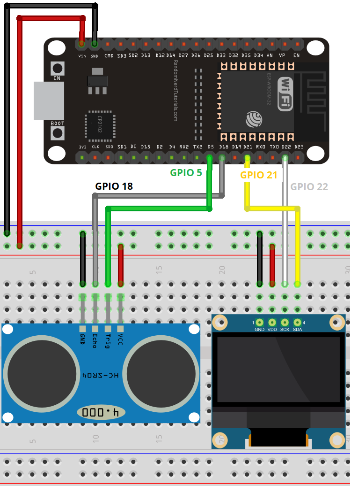
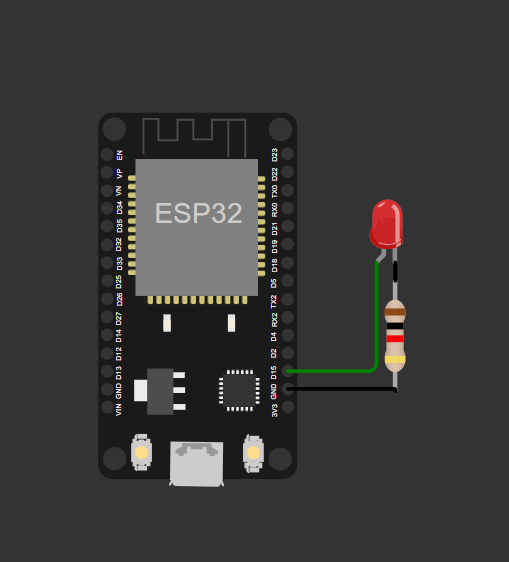
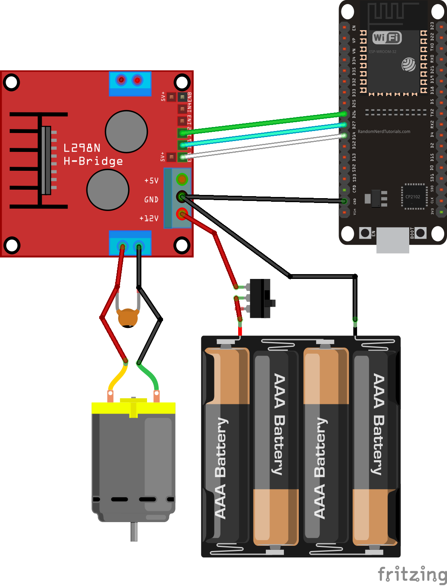
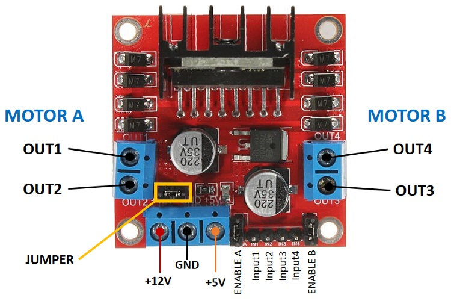

# Wiring

## Current Status

You can follow the wiring diagram below to connect the components to the ESP32-S3 in [**wokwi**](https://wokwi.com/projects/424959675990984705){ target="_blank" }. The wiring diagram is interactive, you can click on it to see the full size image and zoom in.
 
{ target="_blank" }

This circuit integrates an **ESP32-S3** microcontroller with multiple sensors and actuators, including a **DHT22** temperature and humidity sensor, an **HC-SR04** ultrasonic sensor, a **buzzer**, an **LED**, and an **L298N motor driver** controlling **DC motors**. The system is designed for **environmental monitoring and motor control applications**.

[Open Wokwi Diagram](https://wokwi.com/projects/424959675990984705){ width=75% .md-button target="_blank" }

To see all components installed in the breadboard see the [roadmap](../project/roadmap.md) of the project.

!!! note "Esp32-S3 Pins Layout" 
    If you want to see **pins layout** from `esp32-s3` microcontroller go to [**Pin Layout**](../components/index.md#pin-layout) section in components page.

## **Components and Connections**

### **Microcontroller <small>(ESP32-S3)</small>**
- **Power Supply**: The ESP32-S3 is powered via USB **5.0V**.
- **I/O Pins Used**:
  - **GPIO5** → HC-SR04 Trig
  - **GPIO18** → HC-SR04 Echo
  - **GPIO13** → DHT22 Data
  - **GPIO14** → Buzzer Control
  - **GPIO15** → LED Control

### **Temperature and Humidity Sensor <small>(DHT11)</small>**
- **VCC** → 3.3V
- **GND** → GND
- **DATA** → GPIO13 (through a **10kΩ pull-up resistor**)

### **Ultrasonic Distance Sensor <small>(HC-SR04)</small>**
- **VCC** → 3.3V
- **GND** → GND
- **Trig** → GPIO5
- **Echo** → GPIO18

### **Buzzer <small>(5v)</small>**
- **VCC** → 3.3V
- **GND** → GND
- **Control** → GPIO14

### **LED <small>(5mm)</small>**
- **Anode (A)** → GPIO15 (through a **10kΩ resistor**)
- **Cathode (C)** → GND

### **Motor Control <small>(L298N Driver)</small>**
- **Power Supply**: 5V regulated
- **IN1/IN2 (Motor 1)** → ESP32 GPIOs (not fully mapped in image)
- **IN3/IN4 (Motor 2)** → ESP32 GPIOs
- **OUT1/OUT2** → DC Motor 1
- **OUT3/OUT4** → DC Motor 2

## Based on Tutorials 

The wiring diagrams below show how to connect the components to the ESP32-S3. The wiring diagrams was based on tutorial community, see the below examples:

### Temperature Sensor

The ESP32 is a microcontroller that can be programmed to read data from the DHT11 sensor.

{ width=75% }

Code example:

[https://randomnerdtutorials.com/esp32-esp8266-dht11-dht22-micropython-temperature-humidity-sensor/](https://randomnerdtutorials.com/esp32-esp8266-dht11-dht22-micropython-temperature-humidity-sensor/){ target="_blank" }

### Ultrasonic Sensor

The HC-SR04 is a ultrasonic sensor that can be used to measure the distance to an object.

{ width=75% }

Code example:

[https://randomnerdtutorials.com/esp32-hc-sr04-ultrasonic-arduino/](https://randomnerdtutorials.com/esp32-hc-sr04-ultrasonic-arduino/){ target="_blank" }

### Led

The LED 5mm is a light emitting diode that can be used to indicate the status of the robot.

{ width=75% }

Code exemple:

[https://dev.to/shemanto_sharkar/micropython-esp32-blink-led-210d](https://dev.to/shemanto_sharkar/micropython-esp32-blink-led-210d){ target="_blank" }

### Buzzer Melody

Melody

{ width=75% }

[https://micropython-on-wemos-d1-mini.readthedocs.io/en/latest/basics.html#beepers](https://micropython-on-wemos-d1-mini.readthedocs.io/en/latest/basics.html#beepers){ target="_blank" }

### Driver H motor

{ width=49% }

{ width=49% }

[https://randomnerdtutorials.com/esp32-dc-motor-l298n-motor-driver-control-speed-direction/](https://randomnerdtutorials.com/esp32-dc-motor-l298n-motor-driver-control-speed-direction/){ target="_blank" }

[https://randomnerdtutorials.com/micropython-esp32-esp8266-dc-motor-l298n/](https://randomnerdtutorials.com/micropython-esp32-esp8266-dc-motor-l298n/){ target="_blank" }